  <picture>
    <source media="(prefers-color-scheme: dark)" srcset="./dark.svg">
    <source media="(prefers-color-scheme: light)" srcset="./light.svg">
    
  </picture>

  <a href="https://github.com/Yura-108">GitHub</a> ·
  <a href="https://linkedin.com/in/ВАШ_ПРОФИЛЬ">LinkedIn</a>

